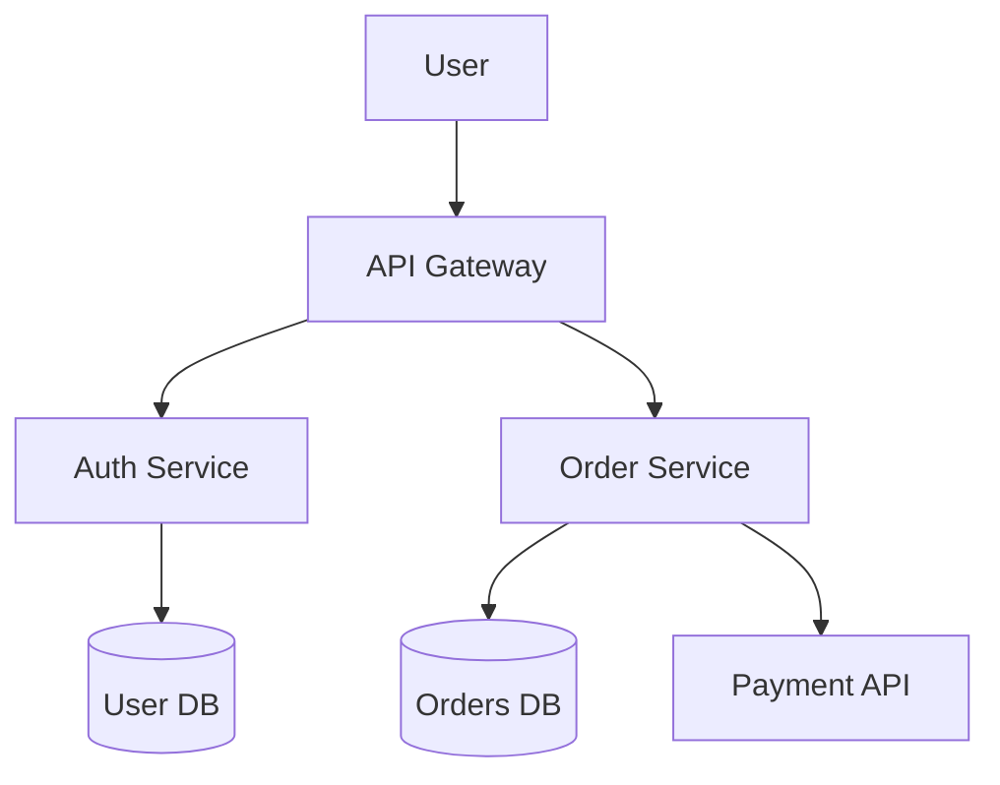
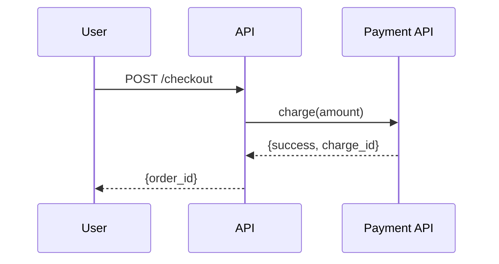
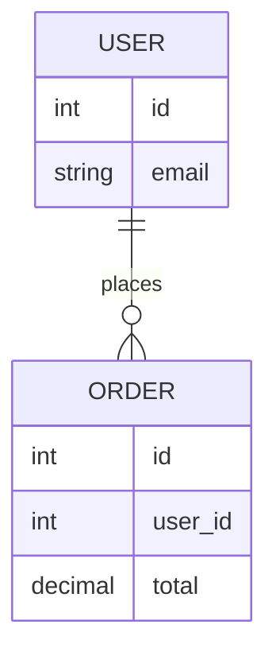

# architecture-diagrams

A diagram that accurately describes your system is one of the most useful artifacts on a team. A diagram that's wrong is worse than none — it misleads. This skill covers how to draw diagrams that communicate clearly and stay accurate.

---

## When to draw a diagram

Draw a diagram when:
- You're explaining a system to someone who doesn't know it
- You're designing something new and need to validate your mental model
- You're onboarding someone to a service they'll need to understand
- You've been debugging the same misunderstanding repeatedly — a diagram may be cheaper than repeating yourself
- You're writing a technical RFC or design doc

Don't draw a diagram to document something no one reads or to satisfy a process requirement no one values.

---

## The C4 model

C4 is a hierarchy of diagram types, each at a different zoom level. Use the level that matches your audience's need.

```
Level 1: Context    — the system in the world; who uses it and what it connects to
Level 2: Container  — the big deployable parts: services, databases, queues
Level 3: Component  — major pieces inside one container
Level 4: Code       — classes, functions (rarely needed; use sparingly)
```

### Level 1 — Context diagram

Shows the system as a black box with its users and external systems around it.

```
[User / Browser]
      |
      v
[Your System]
      |
      +---> [Payment API]
      |
      +---> [Email Service]
```

Audience: anyone — non-technical stakeholders, new engineers, anyone trying to understand scope.

### Level 2 — Container diagram

Opens the box. Shows the deployable parts and how they talk to each other.

```
[Browser]
    |
    v
[React SPA] ---> [API Gateway]
                      |
              +-------+-------+
              |               |
         [Auth Service]  [Order Service]
              |               |
         [User DB]       [Orders DB]
                               |
                         [Payment API]
```

Audience: engineers, architects. Most of your team's work happens at this level.

### Level 3 — Component diagram

Zooms into one container. Shows the major internal components (not every class — major logical groupings).

Use when: a single service is complex enough that someone needs a map to navigate it.

---

## Sequence diagrams

Sequence diagrams show the order of interactions over time — who calls whom, in what order, with what data.

Use them for:
- Auth flows (login, token refresh, OAuth)
- Multi-step transactions (checkout, payment)
- Debugging a complex interaction
- API design before implementation

```
User -> Browser: clicks "Pay"
Browser -> API: POST /checkout {cart_id}
API -> Inventory: check_stock(items)
Inventory -> API: {available: true}
API -> Payment: charge(amount, card_token)
Payment -> API: {status: success, charge_id}
API -> Orders: create_order(cart_id, charge_id)
Orders -> API: {order_id: 12345}
API -> Browser: {order_id: 12345, status: confirmed}
Browser -> User: "Order confirmed"
```

Keep sequence diagrams to 6–10 participants. More than that and they become unreadable.

---

## Mermaid

Mermaid is a text-based diagram format that renders in GitHub, GitLab, Notion, and many other tools. It lives in your repo alongside your code and diffs cleanly.

### Flowchart



### Sequence diagram



### Entity-relationship



### Where Mermaid works

- GitHub Markdown files (native rendering)
- GitLab (native)
- Notion (Mermaid code block)
- Obsidian (with plugin)
- VS Code (with plugin)

For documentation that lives in the repo, Mermaid is the best default choice — diagrams stay with the code and get reviewed in PRs.

---

## AWS architecture diagrams

AWS has official icon sets. Use them consistently so engineers recognize components at a glance.

Tools:
- [draw.io](https://draw.io) (also diagrams.net) — free, has AWS icon library, exports to XML (check into git)
- [Cloudcraft](https://cloudcraft.co) — AWS-specific, can import from your account
- [Lucidchart](https://lucidchart.com) — collaborative, AWS icons, paid

Basic principles for AWS diagrams:
- Group resources by VPC, then by subnet (public vs. private)
- Show availability zones when HA is relevant
- Show security group boundaries for anything security-relevant
- Use region labels if resources span regions

```
┌── AWS Region us-east-1 ───────────────────────────────┐
│                                                        │
│  ┌── VPC ───────────────────────────────────────────┐ │
│  │                                                   │ │
│  │  ┌─ Public subnet ──┐   ┌─ Private subnet ──┐    │ │
│  │  │  [ALB]           │   │  [ECS Fargate]    │    │ │
│  │  │  [NAT Gateway]   │   │  [RDS PostgreSQL] │    │ │
│  │  └──────────────────┘   └───────────────────┘    │ │
│  │                                                   │ │
│  └───────────────────────────────────────────────────┘ │
│                                                        │
└────────────────────────────────────────────────────────┘
```

---

## Excalidraw

[Excalidraw](https://excalidraw.com) is a whiteboard tool with a hand-drawn aesthetic. Good for:
- Informal brainstorming diagrams
- Design sessions where precision isn't the point
- Quick illustrations in docs where you want something less formal than Mermaid

Files are JSON — they can be committed to git. VS Code has an Excalidraw plugin.

---

## What to include and leave out

### Include
- Every external system and data store
- Trust boundaries (where authentication/authorization changes)
- The direction of data flow (arrows with labels)
- Technology names where the tech matters (PostgreSQL, not just "database")
- Names of services as they're known in your org

### Leave out
- Every internal detail of every component (reserve that for component diagrams)
- Infra details that don't affect the design (server specs, IP addresses)
- Anything that changes so frequently the diagram will be wrong immediately

The rule: include anything your audience needs to understand the system at this zoom level. Exclude anything that makes the diagram harder to read without adding understanding.

---

## Keeping diagrams current

Diagrams rot. Systems change; diagrams don't.

Mitigations:
- **Put diagrams in the repo** — they're reviewed in PRs, versioned, and visible to engineers
- **Own the diagrams** — assign someone to update them when the system changes
- **Review diagrams in architecture change proposals** — if the RFC changes the system, update the diagram
- **Check during onboarding** — when a new engineer says "this doesn't match what I see," that's a bug to fix
- **Quarterly pass** — for critical services, look at the diagram every quarter and verify it still matches

A diagram with a date and "last verified by [name]" is more trustworthy than one without.

---

## Tools summary

| Tool | Best for | Source control |
|------|---------|----------------|
| Mermaid | Diagrams in docs/code | Yes (text) |
| draw.io | Complex diagrams, AWS icons | Yes (XML) |
| Excalidraw | Informal, collaborative sketching | Yes (JSON) |
| Cloudcraft | AWS-specific with live import | No |
| Lucidchart | Collaborative, polished, paid | No |

Default to Mermaid for anything that lives in a repo. Use draw.io when you need AWS icons or more layout control. Use Excalidraw for whiteboard sessions.

---

## Related

- Visual communication and diagram design: [`visual-communication`](../visual-communication/SKILL.md)
- Technical RFCs that include diagrams: [`technical-rfcs`](../technical-rfcs/SKILL.md)
- Threat modeling data flow diagrams: [`threat-modeling`](../threat-modeling/SKILL.md)
