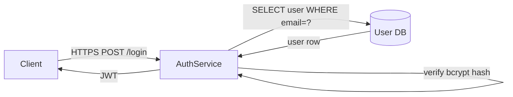
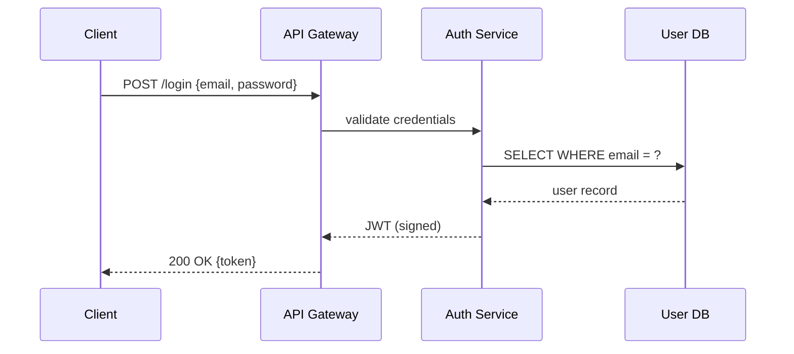
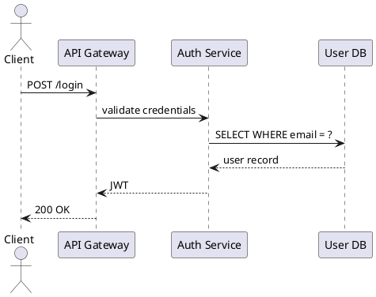

# visual-communication

## What this is

A practical guide to making technical information **clear** through visuals — system diagrams, architecture drawings, data charts, presentation slides, and dashboards. The focus is on the underlying design principles that separate a visual that helps from one that just decorates.

**This skill is not** about CSS or HTML layout (that is **[`web-layout-css`](../web-layout-css/SKILL.md)**), color-contrast tooling (that is **[`web-accessibility`](../web-accessibility/SKILL.md)**), or narrative structure for presentations (see **Related** below). It is about the decisions you make when you reach for a box-and-arrow tool, a charting library, or a slide deck.

## When to use

- You are drawing a system diagram and want it to communicate rather than just exist.
- You are picking a chart type and are not sure which fits the data.
- A diagram or slide is confusing people and you want to know why.
- You are writing an RFC, runbook, or design doc and need to add a visual.
- You want to use Mermaid or PlantUML and need working syntax examples.

---

## 1. The goal of visual communication

A visual is useful when it conveys a **relationship or structure** that would take many words to explain. A bad visual makes the reader work harder than just reading the text.

The 30-second test: can someone who has not read the accompanying text understand the main point of this diagram in 30 seconds? If not, the visual is failing. Common reasons:

- The diagram shows **everything**, not the main point.
- Different kinds of things look the same (boxes for services, databases, users, and queues are all identical rectangles).
- Arrows have no labels or direction indicators.
- The title describes the topic ("System overview") rather than the conclusion ("Auth requests flow left to right through three hops").

Fix one of these at a time. Complexity is usually the first problem; removing elements is usually the right move.

---

## 2. The four relationships visuals show best

Choose the **visual form** based on the relationship you are trying to show, not personal preference or what the tool defaults to.

| Relationship | What it means | Best visual form |
|---|---|---|
| **Hierarchy** | Parent–child structure: org charts, class inheritance, permission models, folder trees | Tree diagram, indented list, nested boxes |
| **Flow** | Ordered steps or decisions: request lifecycle, data pipeline, decision tree, state machine | Flowchart, sequence diagram, swim-lane diagram |
| **Comparison** | Option A vs B vs C, before vs after, this team vs that team | Side-by-side bar chart, table, parallel columns |
| **Proportion** | How much of X vs Y, composition of a total, share of budget or traffic | Stacked bar chart, pie chart (2–3 slices only), treemap |

If you cannot name which relationship your diagram is showing, the diagram does not yet have a point. Name the relationship first, then pick the form.

---

## 3. Tufte's data-ink ratio

Every pixel that does not convey information is **noise**. Edward Tufte's principle: maximize the share of ink devoted to data, minimize the share devoted to everything else.

Remove from charts and diagrams:

- Grid lines behind bars (use tick marks on the axis instead, or none at all)
- 3D effects on bars, pies, or surfaces (they distort the data)
- Decorative borders around chart areas
- Redundant labels (a bar chart with both axis labels and value labels on every bar; pick one)
- Color that carries no meaning (rainbow coloring of a single series adds nothing)
- Chartjunk: clip art, gradients, shadows, textures

**Before (cluttered):** A bar chart with a grey gradient background, a bold border, a legend alongside the bars, value labels on every bar, major and minor grid lines, and a 3D bevel on each bar.

**After (stripped down):** The same bars on a white background, one axis with labels, no border, no legend (the axis labels identify the categories directly), no grid lines, and flat bars. The data is easier to read and the comparison is immediate.

The simplest version of a chart that still communicates the point is the best version. If removing an element makes the chart harder to read, put it back. If removing it makes no difference, it was noise.

---

## 4. The CARP principles for layout

CARP (Contrast, Alignment, Repetition, Proximity) is a layout framework from Robin Williams's *The Non-Designer's Design Book*. Applied to architecture diagrams and technical documentation:

### Contrast

Make **different things look different**. Make **same things look the same**.

In an architecture diagram: if services, databases, and queues all share the same rectangle shape and the same blue fill, the reader has to read every label to understand what kind of thing each box is. Instead, use shape or fill to encode type — rounded rectangles for services, cylinders for databases, parallelograms for queues. A reader should be able to tell the difference at a glance, before reading any label.

### Alignment

**Everything should align to an invisible grid.** No floating elements.

In a diagram: boxes that are slightly off-center, arrows that start at different heights, labels that are inconsistently indented — these create visual noise that signals "this was not thought through." Most diagram tools have a grid-snap option; use it. In documentation: figures should align with the text column, not float past the margin.

### Repetition

**Consistent visual language throughout.** Same shapes for same concepts, always.

In a slide deck: if slide 3 uses a blue callout box to indicate a warning, slide 7 should not use a red dashed border for the same purpose. Decide what each visual element means and use it consistently. In a diagram series: if a cylinder means "database" on diagram 1, it means "database" on diagram 4 even if the reader encounters diagram 4 first.

### Proximity

**Related items should be visually close. Unrelated items should be separated.**

In an architecture diagram: components that communicate with each other belong in the same cluster or swim lane, with whitespace separating them from unrelated clusters. A diagram where all boxes are evenly spaced across the canvas, regardless of their relationships, forces the reader to trace every arrow to reconstruct the groupings. Grouping visually does half that work for the reader before they read a single label.

---

## 5. System architecture diagrams

### Common problems

- **Boxes that do not distinguish between different kinds of things.** Every component is the same rectangle regardless of whether it is a service, a database, a message queue, or an external third party.
- **Arrows that do not show direction or meaning.** An unlabeled bidirectional arrow between two boxes says nothing about what the communication is.
- **Labels that describe what something is called but not what it does.** "auth-service" tells you the name; "validates JWTs and returns user claims" tells you the function. Labels for boxes in an explanatory diagram should favor function over name.

### Better practice

- **Shape or color encodes type.** Pick a small legend (4–5 types at most) and apply it consistently: rounded rectangle = service, cylinder = database, envelope = queue, cloud = external system, person = user/client.
- **Arrow labels state the verb.** "reads from", "publishes to", "authenticates via", "queries (SQL)", "calls REST". A labeled arrow is self-documenting. An unlabeled arrow requires the reader to guess.
- **Consistent flow direction.** Pick left-to-right or top-to-bottom and hold it throughout the diagram. Request flow should travel in one direction; response flow can return in the opposite direction. Mixed flow directions (some paths going left, some going right, some going up) require the reader to constantly reorient.
- **One diagram, one question.** "How does a login request flow?" is one diagram. "What does the entire platform look like?" is a poster, not a diagram. If you need the poster, make it — but also make the focused diagrams.

**Before:** A diagram with 20 boxes, all identical grey rectangles, connected by unlabeled arrows going in multiple directions, with a title that says "Platform Architecture."

**After:** Two focused diagrams — one showing the authentication flow (left to right, 5 components, each arrow labeled with the protocol and verb, shapes differentiated by type), and one showing the data storage layout (top-to-bottom, showing which services write to which databases).

---

## 6. Choosing the right chart type

| You want to show | Use |
|---|---|
| Compare values across categories (how much each team spent) | Bar chart (horizontal if labels are long) |
| Change over time (error rate over the last 30 days) | Line chart |
| Composition of a whole (what fraction of traffic each region handles) | Stacked bar chart, or pie chart for 2–3 slices only |
| Relationship between two variables (latency vs payload size) | Scatter plot |
| Distribution of a single variable (how request latency is distributed) | Histogram or box plot |
| A table of numbers the reader needs to look up | Just use a table |
| Progress toward a single target | Progress bar or bullet chart (not a gauge/speedometer) |

**Rules that are not optional:**

- Never use a pie chart with more than 3 slices. With 4+ slices, human perception of area differences is unreliable. Use a bar chart instead.
- Never use 3D charts. The depth dimension encodes nothing and distorts the data dimension.
- Never use a donut chart where the hole contains a summary number and 7+ categories in the ring — the reader cannot compare arc lengths accurately.
- A dual-axis chart (two y-axes) is almost always confusing. Consider two separate charts instead.

---

## 7. Color — use it sparingly and meaningfully

Color should **encode meaning**, not decorate.

**Practical rules:**

- Use at most **3–4 colors** in a single diagram or chart. More than that and the legend becomes the diagram.
- **One color = one concept** throughout the document. If blue means "write path" on diagram 1, it means "write path" on diagram 4. Do not reuse a color for a different concept in the same document.
- Use **red only for errors, warnings, or critical states**. Readers have strong learned associations with red-as-danger. Using red for a neutral category (e.g., "the APAC region") will create unintended alarm.
- **Check contrast for accessibility.** Color-blind readers (roughly 8% of men) cannot distinguish red from green. Do not rely on red/green alone to convey a pass/fail distinction — add a shape, pattern, or label. See **[`web-accessibility`](../web-accessibility/SKILL.md)** for contrast ratio tooling.
- The most readable architecture diagrams often use **one accent color** on a black/grey/white base. Everything important gets the accent; everything supporting stays neutral.
- If you are exporting to a print format or a projector, test in greyscale. A diagram that is unreadable in greyscale is relying on color alone to communicate structure.

---

## 8. Text in visuals

- **Labels should be close to what they label**, not in a legend. A legend requires the reader to move their eyes back and forth between the key and the visual on every lookup. Direct labeling (placing the text next to the element it describes) is almost always faster to read.
- **Minimum font size: 10pt in any diagram or slide.** Anything smaller is illegible when projected or when a PDF is viewed at normal zoom. When in doubt, zoom out and check.
- **Left-align text in diagrams.** Centered text inside a box is fine for short labels (one or two words). For longer text, left-align. Right-aligned text inside a diagram is rarely correct.
- **Avoid abbreviations that require a glossary.** If the label cannot be understood without consulting a key, the label is doing no work. Write out the full term unless the abbreviation is truly universal in your context (e.g., "SQL", "HTTP").
- **If a label is longer than 3–4 words, consider whether the diagram needs simplifying.** Long labels are often a symptom of a box that is doing too many things. Breaking the box into two simpler components usually results in shorter, clearer labels.

---

## 9. Diagrams as communication, not art

A diagram made with boxes and arrows in a text editor is **better than a beautiful diagram that takes 3 hours to update** when the system changes. Choose tools your teammates can edit.

### Text-based diagram formats

Text-based formats are version-controllable, diffable, and editable without a special application. Two worth knowing:

**Mermaid** (renders in GitHub markdown, Notion, and many wikis):

**PlantUML** (wider diagram type support, needs a renderer):

**draw.io / diagrams.net:** Good for more complex diagrams where text-based syntax would be unwieldy. Stores diagrams as XML (commit the `.drawio` file, not just the exported PNG). Export a PNG for embedding in docs, but keep the source file for future edits.

**When to use which:**

| Tool | Best for | Version control |
|---|---|---|
| Mermaid | Flowcharts, sequence diagrams, simple graphs in markdown | Yes — plain text |
| PlantUML | Sequence, component, state, class diagrams | Yes — plain text |
| draw.io | Complex architecture diagrams, lots of custom shapes | Partial — XML source |
| Excalidraw | Informal sketches, whiteboard-style exploration | Yes — JSON |
| PowerPoint/Keynote | Slides only; avoid for diagrams you will maintain | No |

The rule: if the diagram will need updating as the system evolves (which all architecture diagrams will), choose a format where updates take minutes, not hours.

---

## 10. The slide as a visual argument

A slide deck is a sequence of claims, each supported by evidence. Apply these rules:

**One idea per slide.** If you need two slides to cover one idea, that is fine. If you have two ideas on one slide, split it.

**The title states the conclusion, not the topic.**

- Topic title: "Latency results" — tells the reader nothing; they must interpret the chart themselves.
- Conclusion title: "Latency improved 40% after caching was added" — the reader understands the point before looking at the chart; the chart then confirms it.

Use conclusion titles consistently. The audience should be able to read the slide title sequence alone and follow the argument of the talk, even without attending.

**The visual supports the title claim.** Every chart, diagram, or table on the slide should be there because it provides evidence for the slide's stated conclusion. If a visual is interesting but does not support the title claim, it belongs on a different slide (or in an appendix).

**If the slide needs a paragraph of text to be understood, it is a document, not a slide.** Put the paragraph in a linked document or an appendix. Slides are for the room; documents are for reading. Mixing the two produces slides that are unreadable when projected and documents that are too thin to stand alone.

**Appendix slides are underused.** Put detailed data, full methodology, and supporting charts in numbered appendix slides. Reference them by number during Q&A ("that breakdown is on slide 14"). This keeps the main deck clean while making evidence available.

---

## Related

- CSS and HTML layout: **[`web-layout-css`](../web-layout-css/SKILL.md)**
- Color contrast and accessibility tooling: **[`web-accessibility`](../web-accessibility/SKILL.md)**
- Executive one-pagers: **[`executive-reports`](../executive-reports/SKILL.md)**
- Design proposals with diagrams: **[`technical-rfcs`](../technical-rfcs/SKILL.md)**
- Brainstorming and option exploration: **[`brainstorming-ideation`](../brainstorming-ideation/SKILL.md)**
- Writing clear prose to accompany visuals: **[`docs-clear-writing`](../docs-clear-writing/SKILL.md)**

## Source

Authored for **ai-skills**. Tufte's data-ink ratio principle is from *The Visual Display of Quantitative Information* (Edward Tufte, 1983). CARP principles are from *The Non-Designer's Design Book* (Robin Williams, 1994). Mermaid syntax is current as of Mermaid v10; see [mermaid.js.org](https://mermaid.js.org) for the full reference.
